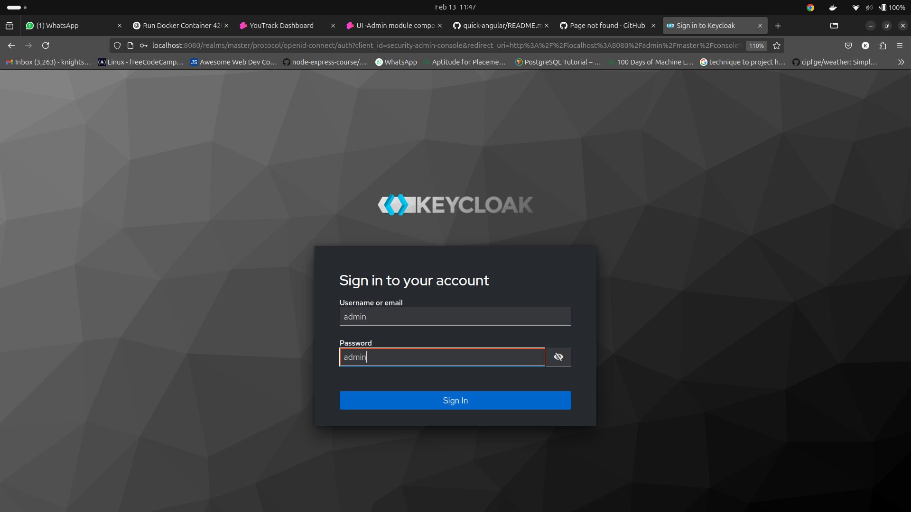
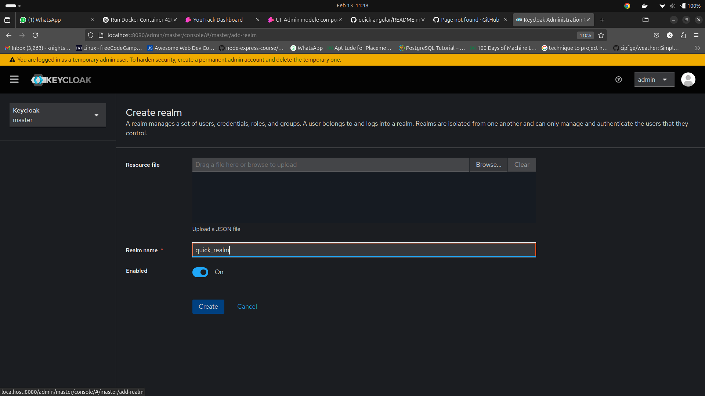
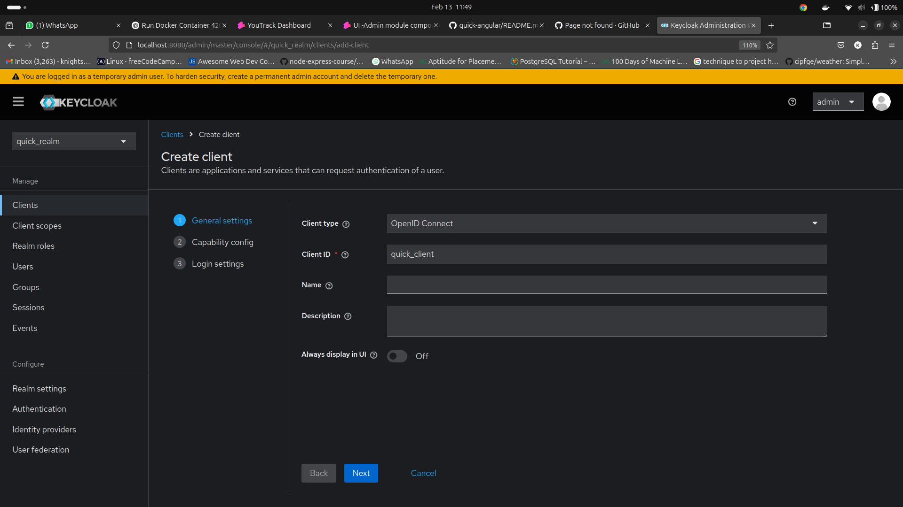
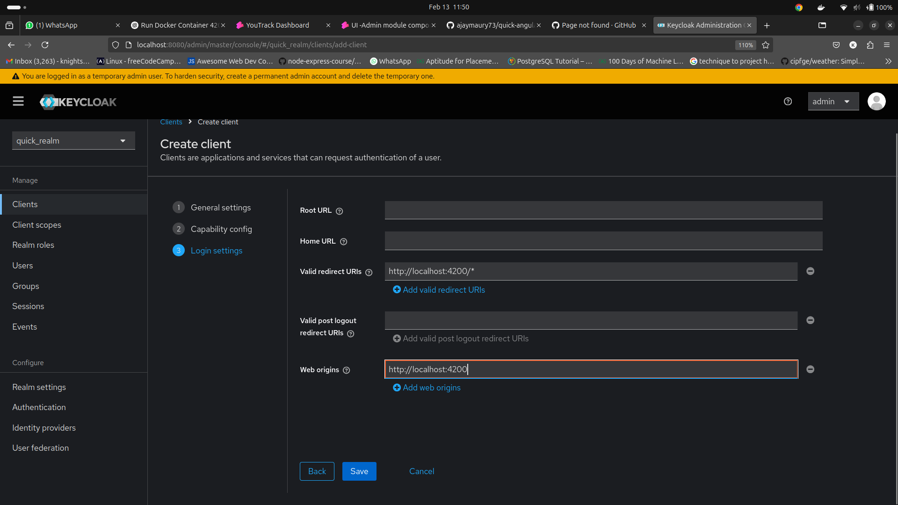
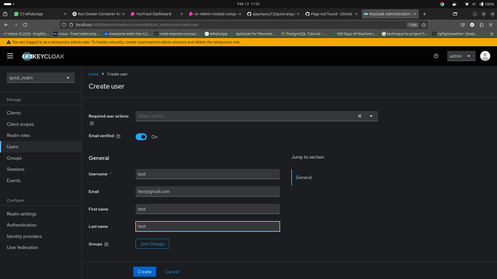
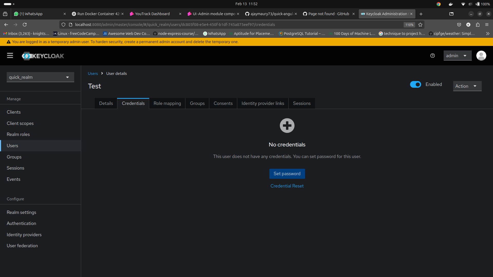
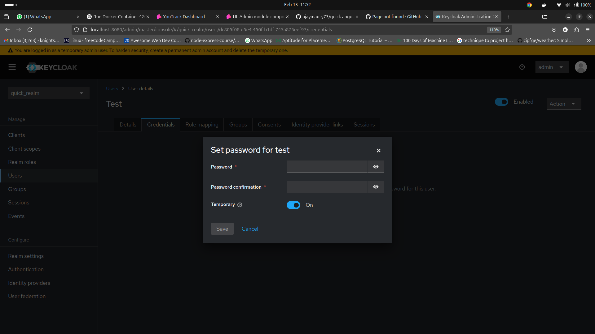

# LMS UI Repo POC

## Setup Instructions

This guide explains the steps to set up the LMS UI repository using Docker containers for the `shell1-ui`, `admin1-ui`, and `mfe1-ui` microfrontends, along with Keycloak for authentication.

### Step 1: Download Latest Versions of Microfrontends

To download the latest versions of `shell1`, `admin1`, and `mfe1` microfrontends, use the following Docker commands. Ensure you replace `xx` with the appropriate version number that you pull from the registry. You can download shell1, admin1, mfe1 or find versions in packages section.

- **Download `shell1-ui`**:
  
  ```bash
  docker pull ghcr.io/saisivaramchalla-inevosys/shell1-ui:vxx
  ```

- **Download `admin1-ui`**:
  
  ```bash
  docker pull ghcr.io/saisivaramchalla-inevosys/admin1-ui:vxx
  ```

- **Download `mfe1-ui`**:
  
  ```bash
  docker pull ghcr.io/saisivaramchalla-inevosys/mfe1-ui:vxx
  ```

### Step 2: Run Docker Containers

After downloading the latest versions, you can run the Docker containers for each microfrontend at their respective port numbers. Replace `xx` with the version number you pulled in Step 1.

- **Run `shell1-ui` on port 4200**:
  
  ```bash
  docker run -d -p 4200:80 --name shell1-ui ghcr.io/saisivaramchalla-inevosys/shell1-ui:vxx
  ```

- **Run `admin1-ui` on port 5500**:
  
  ```bash
  docker run -d -p 5500:80 --name admin1-ui ghcr.io/saisivaramchalla-inevosys/admin1-ui:vxx
  ```

- **Run `mfe1-ui` on port 5000**:
  
  ```bash
  docker run -d -p 5000:80 --name mfe1-ui ghcr.io/saisivaramchalla-inevosys/mfe1-ui:vxx
  ```

### Step 3: Run Keycloak in Docker (if not already configured)

If Keycloak is not already set up, you can follow the instructions from the [inevosys-lms-cp-setup repository](https://github.com/inevosys/inevosys-lms-cp-setup) to run Keycloak in Docker on port `8080` for authentication.


### Step 4: Configure Keycloak

After running Keycloak, access it via [http://localhost:8080](http://localhost:8080) using the admin credentials (`admin` as both username and password).




#### 4.1 Create a New Realm

1. **Log in to Keycloak** at [http://localhost:8080](http://localhost:8080) using the credentials `admin/admin`.
2. Go to the **Master** realm and click on **Add realm**.
3. Enter the name of the new realm as `quick_realm` and save.



#### 4.2 Create a New Client

1. Under the `quick_realm`, click on **Clients** in the left sidebar and then **Create**.
2. Enter the client ID as `quick_client`.
3. Set the **Client Protocol** to `openid-connect` and save.




#### 4.3 Configure Redirect URL and Web Origins

1. In the `quick_client` settings, scroll to the **Valid Redirect URIs** field and enter:
   
   ```plaintext
   http://localhost:4200/*
   ```

2. Under **Web Origins**, enter:
   
   ```plaintext
   http://localhost:4200
   ```



#### 4.4 Set Client Credentials

1. In the `Credentials` tab, set the **Username** and **Password** of your choice.
   
   - Username: `your_username`
   - Password: `your_password`







---

### Step 5: Access Microfrontends

Once the containers are up and running, you can access each microfrontend by visiting the following URLs:

- `shell1-ui`: [http://localhost:4200](http://localhost:4200)
- `admin1-ui`: [http://localhost:5500](http://localhost:5500)
- `mfe1-ui`: [http://localhost:5000](http://localhost:5000)
- Keycloak: [http://localhost:8080](http://localhost:8080)

---

## Notes

- Ensure Docker is installed and running on your system.
- Replace `xx` with the appropriate version numbers when pulling images and running containers.
- For any issues related to the microfrontends or Keycloak, please refer to the respective repositories for troubleshooting.
```

